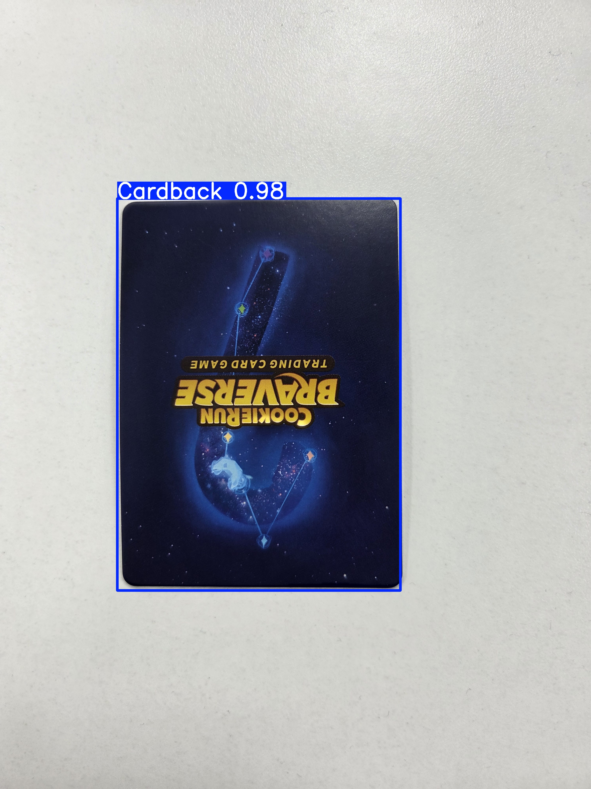
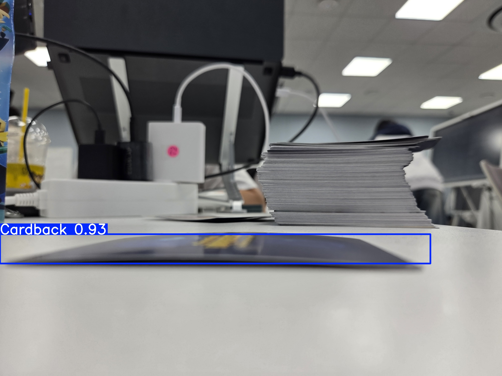
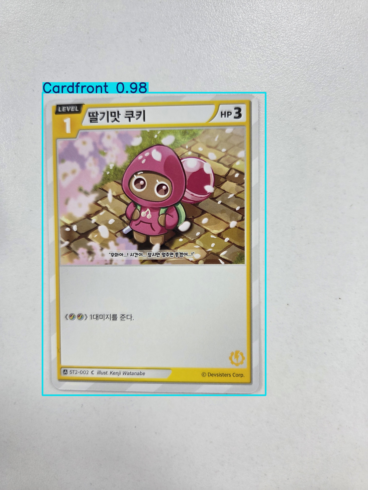
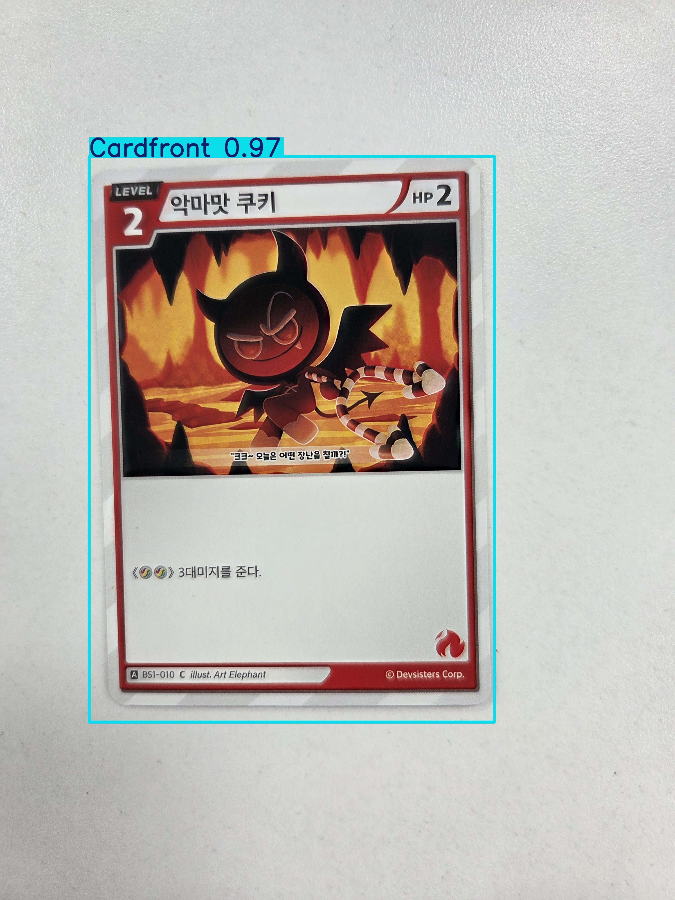
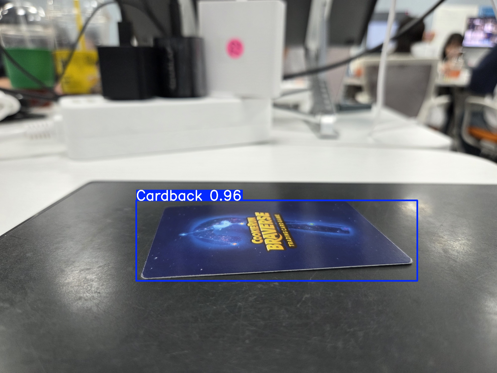

# 1주차 개발 진행사항: 

## 1. 카드 상태 판정 기준 알아보기
감점(결함) : 흠집, 구김, 찢어짐, 모서리 닳음, 얼룩
가점 : 정렬 상태(카드 프레임이 카드 정 중아에 인쇄되어 있는지)

## 2. 상태 판단 플로우차트 구상하기
- 업로드한 이미지 4장이 카드인지 판단
- 사진 상태 판단(빛 과반사, 이미지 크기)
- 찢어짐, 구김, 구멍, 큰 얼룩 판단
- 테두리 상태 판단(변색, 닳음)
- 카드 휨 상태 판단
- 종합 및 등급 판정

## 3. 모델 개발

### 목표:
- 카드의 4면 이미지(앞면, 뒷면, 긴 쪽 모서리, 짧은 쪽 모서리)가 모두 카드 이미지가 맞는지 판단

### 구현 방법:
- YOLO를 사용하여 바운딩 박스를 학습
- 데이터셋이 충분하지 않기에 카드 사진을 직접 찍어서 학습

### 구현 과정:
- MLflow를 사용하여 실험 과정을 기록할 수 있게 서버를 세팅한다.
- 카드 사진을 찍는다(종류별 50장씩 총 200장가량).
- label studio를 사용하여 바운딩 박스를 지정한다.
- YOLO에 학습시킨다.
- 사전에 찍어뒀던 200장에 predict 시킨 후 정확도를 확인한다.
- 각종 지표를 확인하면서 결과를 평가한다.

## 4. 구현 결과:

### 지표 해석:
1. Train Loss (상단 첫 줄 3개)

train/box_loss: 박스 위치 예측 오차. → 에폭이 진행될수록 꾸준히 감소 → 모델이 점점 더 정확히 바운딩 박스를 잡고 있음.

train/cls_loss: 클래스 분류 오차. → 빠르게 줄어들고 있음 → 클래스 구분 성능이 잘 향상됨.

train/dfl_loss: Distribution Focal Loss. → 박스 경계 정밀도 관련. 천천히 감소 → 안정적으로 학습 중.

✅ 학습 손실은 전반적으로 꾸준히 감소 → 과적합 신호 없음.

2. Validation Loss (하단 첫 줄 3개)

val/box_loss, val/cls_loss, val/dfl_loss:
초반에는 요동이 크지만, 10 epoch 이후로는 안정적으로 감소.
→ 데이터셋이 충분히 학습되고 있다는 의미.
→ 중간중간 튀는 값은 batch 단위 샘플링 영향으로 보임 (심각한 문제 아님).

✅ 검증 손실도 전반적으로 감소 → 학습/검증 간 갭이 크지 않아 과적합은 거의 없음.

3. Precision / Recall (상단 오른쪽 2개)

Precision (정밀도): 0.95~1.0 근처에서 안정화. → 모델이 잘못 탐지하는 경우(오탐)가 거의 없음.

Recall (재현율): 1.0에 수렴. → 실제 객체를 거의 다 탐지한다는 의미.

✅ 탐지 모델로서 이상적인 성능: 놓치지도 않고, 잘못 잡지도 않음.

4. mAP (하단 오른쪽 2개)

mAP@0.5: 거의 1.0에 수렴 → IOU 0.5 기준에서는 완벽에 가까움.

mAP@0.5:0.95: 0.9 이상에서 수렴 → IOU 기준을 까다롭게 해도 여전히 높은 정확도 유지.

✅ 모델이 위치까지 정밀하게 잘 잡고 있다는 뜻.

종합 해석

학습 손실/검증 손실 모두 안정적으로 감소, 과적합 없음.

Precision ≈ 0.99, Recall ≈ 1.0 → 객체 탐지 놓침이 거의 없음.

mAP50 ≈ 1.0, mAP50-95 ≈ 0.9 → 위치와 크기까지 상당히 정확히 예측.

전반적으로 매우 성공적인 학습 결과.
→ 데이터셋 품질이 괜찮고, 모델이 충분히 수렴했다고 볼 수 있음.

### 추가: 예측 결과

